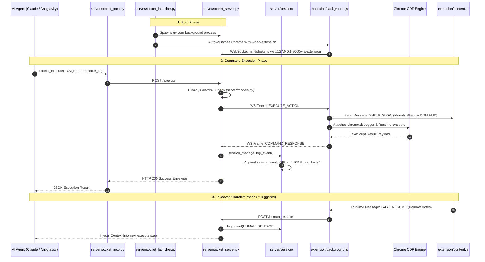

# 🔌 AgentSocket Complete Codebase & Architectural Specification

**Version:** 2.0.0 (Clean Architecture & Modular Engine)  
**Specification Type:** Master Engineering Documentation & Component Reference  
**Scope:** Complete Python Server, Modular Session Subsystem, Universal Adhoc Tool Suite, MV3 Chrome Extension, FastMCP Subsystem, CDP Execution Engine, Shadow DOM HUD, Tasks Layer, and Automated Test Suite.

---

# 1. Executive Architecture & System Topology

AgentSocket is a zero-latency, plug-and-play browser automation gateway and Model Context Protocol (MCP) server. It connects AI agent frameworks (e.g., Claude Code, Google Antigravity, Cursor, Hermes, custom agentic workflows) directly to local Chrome browser sessions via a high-speed FastAPI WebSocket bridge, Chrome DevTools Protocol (CDP), and human-agent takeover workflows.

```
┌─────────────────────────────────────────────────────────────────────────────────────────┐
│                                SYSTEM ARCHITECTURE TOPOLOGY                             │
└─────────────────────────────────────────────────────────────────────────────────────────┘

 ┌──────────────────────────┐             ┌──────────────────────────┐
 │  AI Agent (Claude Code,  │             │   Command-Line Interface │
 │   Antigravity, Custom)   │             │   (socket_launcher.py)   │
 └─────────────┬────────────┘             └────────────┬─────────────┘
               │                                       │
               │ (stdio MCP Protocol)                  │ (REST / Local Python)
               ▼                                       ▼
 ┌───────────────────────────────────────────────────────────────────┐
 │                   server/socket_mcp.py (FastMCP)                  │
 └─────────────────────────────────┬─────────────────────────────────┘
                                   │
                                   ▼
 ┌───────────────────────────────────────────────────────────────────┐
 │                server/socket_server.py (FastAPI Gateway)          │
 │  - Structured Logger (server/logger.py -> sys.stderr)             │
 │  - Session & Inactivity Watchdogs (300s timeout)                  │
 │  - Sensitive Scope & Privacy Gatekeepers                          │
 │  - Human Intervention State Machine & Graceful Lifespan           │
 └───────────────┬───────────────────────────────────┬───────────────┘
                 │                                   │
                 ▼                                   ▼
 ┌──────────────────────────────┐    ┌──────────────────────────────┐
 │ server/session/ (Subsystem)  │    │ (WebSocket Bridge :8000)     │
 │  - manager.py (Lifecycle)    │    │ ws://127.0.0.1:8000/ws/ext   │
 │  - storage.py (Atomic Index) │    └───────────────┬──────────────┘
 │  - formatter.py (Timelines)  │                    │
 │  - documenter.py (Reports)   │                    ▼
 │  - Auto-Seeding Adhocs Suite │    ┌──────────────────────────────┐
 └──────────────────────────────┘    │ Chrome Extension Service     │
                                     │ Worker (background.js)       │
                                     │  - MV3 Storage Hydration     │
                                     │  - ResilientSocket Client    │
                                     │  - Tab Group Manager         │
                                     │  - CDP Controller (debugger) │
                                     └───────┬──────────────┬───────┘
                                             │              │
                     ┌───────────────────────┘              └───────────────────────┐
                     ▼                                                              ▼
 ┌───────────────────────────────────────┐                      ┌───────────────────────────────────────┐
 │ Active Browser Tab (content.js)       │                      │ Extension UI & Settings               │
 │  - Shadow DOM HUD (#agentsocket-host) │                      │  - popup.html / popup.js (Settings)   │
 │  - Clean Encapsulated CSS Rules       │                      │  - auth.html / auth.js (Auth Gate)    │
 │  - KeyboardGuard & Interaction Shield │                      │  - protocol.js (Shared Constants)     │
 │  - Takeover Overlay & Handoff Modal   │                      └───────────────────────────────────────┘
 └───────────────────────────────────────┘
```

---

# 2. Complete Repository File Structure & Inventory

```
agent_bro_hands/
├── .agents/
│   └── skills/
│       └── browser-socket/
│           └── SKILL.md                 # Antigravity/Agentic Skill Definition
├── docs/
│   └── codebase_master_specification.md # Master architectural and code documentation
├── extension/
│   ├── manifest.json                    # Chrome Extension Manifest V3 configuration
│   ├── protocol.js                      # Universal message types, actions, & response envelopes (UMD)
│   ├── background.js                    # MV3 Service worker: WebSocket hub, storage cache, tab manager, CDP engine
│   ├── content.js                       # On-page Shadow DOM HUD, keyboard guard, & takeover modal
│   ├── popup.html                       # Extension toolbar popup interface
│   ├── popup.js                         # Popup UI controller, socket settings, port scanner
│   ├── auth.html                        # One-time agent authorization page
│   ├── auth.js                          # Authorization grant/deny handler
│   └── icons/                           # Extension icon assets (16x16, 48x48, 128x128)
├── server/
│   ├── __init__.py
│   ├── logger.py                        # Centralized structured logger targeting sys.stderr
│   ├── models.py                        # PEP 604 Pydantic v2 schemas, event models, & typed Enums
│   ├── session/                         # Modular Session Subsystem Package
│   │   ├── __init__.py                  # Package exports
│   │   ├── manager.py                   # Core SessionManager, active lifecycle, adhoc auto-seeding
│   │   ├── storage.py                   # Atomic index read/write, history queries, artifact resolution
│   │   ├── formatter.py                 # ASCII timeline thread & table formatting utilities
│   │   └── documenter.py                # Markdown document generator (SESSION_DOCUMENT.md & master exports)
│   ├── session_manager.py               # Backward-compatible re-export shim
│   ├── templates/
│   │   └── adhocs/                      # Universal Standard Adhoc Tool Suite (Auto-seeded to sessions)
│   │       ├── __init__.py
│   │       ├── navigate.py              # Normalized URL navigation with latency tracking
│   │       ├── write_input.py           # Robust input/textarea/contenteditable typing
│   │       ├── type_input.py            # Alias wrapper for write_input
│   │       ├── click_element.py         # Centered scroll & native click event dispatch
│   │       ├── extract_text.py          # Single/multi text & attribute extraction
│   │       ├── scroll_page.py           # Directional scrolling & bottom boundary detection
│   │       ├── eval_js.py               # JavaScript expression & script file evaluator
│   │       └── take_screenshot.py       # Visual checkpoint snapshot capture
│   ├── socket_server.py                 # FastAPI gateway, WebSocket endpoint, watchdog loops, graceful exit
│   ├── socket_launcher.py               # Smart launcher, declarative CLI dispatcher, named process bitmasks
│   ├── socket_mcp.py                    # Model Context Protocol stdio server with defensive error wrappers
│   ├── browser_socket.py                # Direct CLI execution entrypoint alias
│   └── logs/                            # Local session logs & artifact storage (gitignored)
│       ├── subskills_index.json         # Central Registry of reusable subskills & playbooks
│       ├── sessions/
│       │   └── history_logs/
│       │       └── index.json           # Centralized monthly master index
│       └── YYYY-MM-DD/
│           └── <Session_Title>_<time>_gid<tabGroupId>/
│               ├── SESSION_DOCUMENT.md  # Comprehensive auto-generated executive session report
│               ├── session.jsonl        # Line-delimited event log with step latencies
│               ├── sub_skill.md         # Reusable playbook contract with selectors & rules
│               ├── input/               # Source datasets & input batch CSVs
│               ├── output/              # Scraped datasets, enriched CSVs, and deliverables
│               ├── adhocs/              # Cloned universal + session-specific adhoc scripts
├── specs/                               # Engineering Feature Specifications (00 to 15)
├── tests/                               # Automated Test Suite (49 Python tests + JS suite)
│   ├── test_logger.py                   # Structured logger stream and level unit tests
│   ├── test_models.py                   # Pydantic schema validation & envelope unit tests
│   ├── test_session_manager.py          # Modular session manager, lifecycle, offload unit tests
│   ├── test_subskills.py                # Subskills registry & borrowing engine integration tests
│   ├── test_server.py                   # FastAPI gateway & human takeover integration tests
│   ├── test_launcher.py                 # Smart launcher, process flags, CLI parser unit tests
│   ├── test_adhocs.py                   # Universal adhoc tools CLI & auto-seeding unit tests
│   └── test_protocol.test.js            # JavaScript protocol unit tests
├── .gitignore                           # Git ignore rules protecting private logs, artifacts, and caches
├── README.md                            # Primary project documentation
└── SKILL.md                             # Root-level skill reference
```

---

# 3. System Execution Lifecycles & Runtime Order

The runtime behavior of AgentSocket progresses through distinct, deterministically ordered execution phases:



### Execution Order Hierarchy

| Order Step | Action Trigger | Active Files & Sequence |
|:---|:---|:---|
| **Step 1: System Boot** | Subsystem Init / CLI start | [`server/logger.py`](file:///c:/Users/20106/agent_bro_hands/server/logger.py) -> [`server/models.py`](file:///c:/Users/20106/agent_bro_hands/server/models.py) -> [`server/socket_launcher.py`](file:///c:/Users/20106/agent_bro_hands/server/socket_launcher.py) -> [`server/socket_server.py`](file:///c:/Users/20106/agent_bro_hands/server/socket_server.py) (FastAPI lifespan) |
| **Step 2: Browser Handshake** | Chrome launches | [`extension/background.js`](file:///c:/Users/20106/agent_bro_hands/extension/background.js) -> [`extension/protocol.js`](file:///c:/Users/20106/agent_bro_hands/extension/protocol.js) (WebSocket connects to `ws://127.0.0.1:8000/ws/extension`) |
| **Step 3: Agent Command** | Tool invocation | [`server/socket_mcp.py`](file:///c:/Users/20106/agent_bro_hands/server/socket_mcp.py) -> [`server/socket_server.py`](file:///c:/Users/20106/agent_bro_hands/server/socket_server.py) (`POST /execute`) |
| **Step 4: Tab Interaction** | Browser action | [`extension/background.js`](file:///c:/Users/20106/agent_bro_hands/extension/background.js) (CDP evaluate) + [`extension/content.js`](file:///c:/Users/20106/agent_bro_hands/extension/content.js) (Shadow DOM HUD & Interaction Shield) |
| **Step 5: Logging & Offload** | Action completed | [`server/session/manager.py`](file:///c:/Users/20106/agent_bro_hands/server/session/manager.py) -> [`server/session/storage.py`](file:///c:/Users/20106/agent_bro_hands/server/session/storage.py) (Appends `session.jsonl`, offloads >10KB payloads to `artifacts/`) |
| **Step 6: Task Wrap-up** | Task completion | [`server/session/documenter.py`](file:///c:/Users/20106/agent_bro_hands/server/session/documenter.py) (Synthesizes `SESSION_DOCUMENT.md`) -> [`server/session/storage.py`](file:///c:/Users/20106/agent_bro_hands/server/session/storage.py) (Updates `index.json`) |

---

# 4. File-by-File Catalog & Dependency Mapping

---

## 🟢 Category 1: Server Gateway & Process Orchestration

### 1. [`server/logger.py`](file:///c:/Users/20106/agent_bro_hands/server/logger.py)
- **When It Runs:** Imported immediately on startup by all Python server modules, session subsystems, and CLI runners.
- **Usage:** Provides structured logging (`logging.getLogger("agentsocket")`) routing log events to `sys.stderr`. Severity level is dynamically configured via `SOCKET_LOG_LEVEL`.
- **System Importance:** **Critical Invariant.** All server diagnostics **must write to `sys.stderr`**, never `sys.stdout`. If diagnostics leak into `sys.stdout`, the stdio transport stream of the Model Context Protocol ([`server/socket_mcp.py`](file:///c:/Users/20106/agent_bro_hands/server/socket_mcp.py)) will corrupt, causing the AI agent's tool parser to crash.

---

### 2. [`server/models.py`](file:///c:/Users/20106/agent_bro_hands/server/models.py)
- **When It Runs:** Imported during server initialization, request validation, and test executions.
- **Usage:** Contains all Pydantic v2 data models, PEP 604 union type annotations, and typed enums (`ActionType`, `WSMessageType`, `ControlMode`, `ResponseStatus`, `ErrorCode`, `SessionEventType`, `SubskillModel`).
- **System Importance:** **Core Contract.** Acts as the single source of truth for message shapes and schemas across FastAPI endpoints, session records, and client responses. Prevents schema drift and runtime type errors.

---

### 3. [`server/socket_launcher.py`](file:///c:/Users/20106/agent_bro_hands/server/socket_launcher.py)
- **When It Runs:** 
  1. Triggered whenever the user or agent runs a CLI command (e.g. `python server/socket_launcher.py status|plug|history|subskills`).
  2. Invoked internally by [`server/socket_mcp.py`](file:///c:/Users/20106/agent_bro_hands/server/socket_mcp.py) via `ensure_ready()`.
- **Usage:**
  - Auto-detects Chrome/Chromium executable locations across Windows Registry, macOS, and Linux paths.
  - Spawns the background FastAPI gateway if offline (`ensure_server_running`).
  - Launches Chrome with `--load-extension` and named Windows bitmasks (`WIN_CREATE_FLAGS`).
  - Dispatches CLI commands via a clean declarative `COMMAND_DISPATCH` dictionary.
- **System Importance:** **Process Lifecycle Controller.** Guarantees the entire browser automation environment is booted and ready on demand without manual setup.

---

### 4. [`server/socket_server.py`](file:///c:/Users/20106/agent_bro_hands/server/socket_server.py)
- **When It Runs:** Runs continuously as a background FastAPI web server on port `8000`.
- **Usage:**
  - Hosts the bidirectional WebSocket endpoint (`/ws/extension`) that the Chrome Extension connects to.
  - Exposes REST endpoints (`/execute`, `/human_release`, `/stop`, `/status`, `/history`, `/subskills`).
  - Manages the **Privacy Guardrail Check** (detects keywords like `password`, `bank`, `login` and triggers `SECURITY_ABORT`).
  - Runs the **Auto-Idle Watchdog** (shuts down cleanly via `signal.SIGINT` if idle for >20 minutes).
- **System Importance:** **Central Nervous System.** Coordinates all commands between the AI agent, the persistent session storage, and the Chrome Extension.

---

### 5. [`server/socket_mcp.py`](file:///c:/Users/20106/agent_bro_hands/server/socket_mcp.py)
- **When It Runs:** Launched by AI coding environments (Claude Code, Antigravity IDE, Cursor) as a long-running stdio MCP subprocess.
- **Usage:** Exposes 12 standard Model Context Protocol tools (`socket_execute`, `socket_status`, `socket_release_takeover`, `socket_query_history`, `socket_list_subskills`, `socket_borrow_subskill`, etc.).
- **System Importance:** **Agent Interface.** The sole bridge enabling AI agents to autonomously control the browser, query past session memory, and borrow reusable skills using native tool calling.

---

### 6. [`server/browser_socket.py`](file:///c:/Users/20106/agent_bro_hands/server/browser_socket.py)
- **When It Runs:** Invoked as a direct CLI alias.
- **Usage:** Re-exports and runs `socket_launcher.main()`.
- **System Importance:** Ergonomic entrypoint alias for quick shell interaction.

---

## 🗄️ Category 2: Modular Session Subsystem (`server/session/`)

### 7. [`server/session/storage.py`](file:///c:/Users/20106/agent_bro_hands/server/session/storage.py)
- **When It Runs:** Whenever sessions are created, queried, or finalized.
- **Usage:**
  - Performs atomic disk reads and writes for monthly `index.json` and `subskills_index.json` (writes to temp file, then renames in-place).
  - Resolves directory paths for session folders (`input/`, `output/`, `adhocs/`, `artifacts/`).
  - Executes fuzzy history queries and retrieves offloaded heavy payloads.
- **System Importance:** **Data Integrity Gate.** Guarantees that crashes mid-write never corrupt the master history indices.

---

### 8. [`server/session/formatter.py`](file:///c:/Users/20106/agent_bro_hands/server/session/formatter.py)
- **When It Runs:** When displaying session logs, CLI tables, or rendering `SESSION_DOCUMENT.md`.
- **Usage:**
  - Renders the chronological ASCII timeline tree (`format_session_thread`) showing relative timestamps `(T+SS.Ss)`, action icons, and latencies.
  - Formats tables: `print_history_table`, `print_subskills_table`, `print_subskill_details`, `print_session_logs`.
- **System Importance:** **Human & Agent Observability.** Turns raw JSONL streams into clear, readable chronological timeline representations.

---

### 9. [`server/session/documenter.py`](file:///c:/Users/20106/agent_bro_hands/server/session/documenter.py)
- **When It Runs:** When a session is finalized (`TASK_COMPLETE`, `STOPPED`, `ABORTED`) or when requested via `/session/document`.
- **Usage:** Compiles an all-in-one Markdown document (`SESSION_DOCUMENT.md`) containing executive metadata, playbook rules (`sub_skill.md`), file inventories, and full chronological ASCII threads. Also exports master history reports.
- **System Importance:** **Session Deliverable Compiler.** Generates permanent, self-contained documentation for every browser automation run.

---

### 10. [`server/session/manager.py`](file:///c:/Users/20106/agent_bro_hands/server/session/manager.py)
- **When It Runs:** Continuously manages active session objects in memory (`ActiveSession`).
- **Usage:**
  - Allocates date-partitioned session folders (`server/logs/YYYY-MM-DD/<Title>_<time>_gid<id>/`).
  - **Auto-seeds universal adhocs** into `<session>/adhocs/` upon session creation.
  - Appends events to `session.jsonl` with **Threshold Offloading** (payloads >10KB or >50 items offloaded to `artifacts/`).
  - Handles inactivity timeouts (300s) and browser disconnect aborts.
  - Orchestrates subskill borrowing and registration.
- **System Importance:** **Core Session Orchestrator.** Singleton instance `session_manager` controls all runtime logging and lifecycle state.

---

### 11. [`server/session/__init__.py`](file:///c:/Users/20106/agent_bro_hands/server/session/__init__.py) & [`server/session_manager.py`](file:///c:/Users/20106/agent_bro_hands/server/session_manager.py)
- **When It Runs:** On import from other packages.
- **Usage:** `server/session/__init__.py` exposes clean module exports. `server/session_manager.py` acts as a backward-compatible shim re-exporting everything so legacy imports continue working without changes.
- **System Importance:** Preserves backward compatibility across the entire repository.

---

## 🛠️ Category 3: Universal Standard Adhoc Tool Suite (`server/templates/adhocs/`)

These 8 tools are **automatically cloned into `<session_dir>/adhocs/`** whenever any new session starts:

| Tool File | When It Runs | Core Purpose | Importance |
|:---|:---|:---|:---|
| **[`navigate.py`](file:///c:/Users/20106/agent_bro_hands/server/templates/adhocs/navigate.py)** | Called by agent/scripts to open URLs | Normalizes URLs, binds to session tab group, tracks navigation latency | Basic navigation primitive with standard exit codes |
| **[`write_input.py`](file:///c:/Users/20106/agent_bro_hands/server/templates/adhocs/write_input.py)** | Called to type into inputs / textareas | Locates element (CSS/XPath), scrolls, focuses, triggers full event cycle (`keydown`, `input`, `keyup`, `change`), optional Enter & blur | Native DOM input simulation bypassing synthetic event traps |
| **[`type_input.py`](file:///c:/Users/20106/agent_bro_hands/server/templates/adhocs/type_input.py)** | Alias for `write_input.py` | Forwards execution to `write_input.py` | Ergonomic command alias |
| **[`click_element.py`](file:///c:/Users/20106/agent_bro_hands/server/templates/adhocs/click_element.py)** | Called to click buttons/links | Centers element in view, dispatches `mousedown` -> `mouseup` -> `click` | Robust clicking primitive |
| **[`extract_text.py`](file:///c:/Users/20106/agent_bro_hands/server/templates/adhocs/extract_text.py)** | Called to scrape text or attributes | Extracts text content or specific attributes (`href`, `src`, `data-*`) from single or multiple matching nodes | Clean data extraction without writing ad-hoc JS |
| **[`scroll_page.py`](file:///c:/Users/20106/agent_bro_hands/server/templates/adhocs/scroll_page.py)** | Called to paginate feeds or reach page ends | Smooth directional scrolling (`down`, `up`, `top`, `bottom`) with repeat intervals and bottom detection | Feed pagination & infinite scroll handling |
| **[`eval_js.py`](file:///c:/Users/20106/agent_bro_hands/server/templates/adhocs/eval_js.py)** | Called for complex page evaluations | Executes arbitrary JS strings or script files via CDP | Flexible execution fallback |
| **[`take_screenshot.py`](file:///c:/Users/20106/agent_bro_hands/server/templates/adhocs/take_screenshot.py)** | Called to record visual checkpoints | Captures viewport or element snapshots into `artifacts/` | Visual state verification |

---

## 🧩 Category 4: Chrome Extension Subsystem (`extension/`)

### 12. [`extension/manifest.json`](file:///c:/Users/20106/agent_bro_hands/extension/manifest.json)
- **When It Runs:** Read by Chrome when the extension is loaded.
- **Usage:** Configures Manifest V3 settings, background service worker, content scripts, permissions (`debugger`, `tabGroups`, `storage`, `notifications`, `alarms`), and host permissions (`<all_urls>`).
- **System Importance:** Required entrypoint for Chrome to load and execute the extension.

---

### 13. [`extension/protocol.js`](file:///c:/Users/20106/agent_bro_hands/extension/protocol.js)
- **When It Runs:** Loaded by the background service worker, injected content scripts, and Node.js test suites (Universal Module Definition).
- **Usage:** Defines frozen protocol constants (`MessageTypes`, `ActionTypes`, `ResponseStatus`, `ErrorCodes`) and uniform envelope factories (`createResponseEnvelope`, `createErrorEnvelope`).
- **System Importance:** Single source of truth for message passing between Chrome and Python.

---

### 14. [`extension/background.js`](file:///c:/Users/20106/agent_bro_hands/extension/background.js)
- **When It Runs:** Runs as a Manifest V3 Service Worker in the browser background.
- **Usage:**
  - Maintains the `ResilientSocket` WebSocket connection to the gateway server (`ws://127.0.0.1:8000/ws/extension`).
  - Persists `activeSessions` to `chrome.storage.local` to survive Service Worker idle sleep.
  - Manages Chrome tab groups (creating, coloring, renaming on completion).
  - Drives the Chrome DevTools Protocol (`chrome.debugger`) to execute zero-CSP JavaScript in active tabs.
  - Re-injects HUD on tab navigation updates (`changeInfo.status === "complete"`).
- **System Importance:** **Browser Execution Engine.** Executes low-level CDP commands and manages tab state.

---

### 15. [`extension/content.js`](file:///c:/Users/20106/agent_bro_hands/extension/content.js)
- **When It Runs:** Automatically injected into every web page upon load.
- **Usage:**
  - Mounts an isolated Shadow DOM container (`<agentsocket-hud-host>`).
  - Activates the **Interaction Shield & `keyboardGuard`** during autonomous runs (blocks accidental page clicks/typing, directs user to "Take Over").
  - Displays the Notion-styled floating HUD pill with the active session title and action buttons.
  - Renders the **Handoff Notes Modal** when releasing control back to the agent.
- **System Importance:** **On-Page User Interface.** Provides visual transparency, prevents user-agent input collision, and facilitates seamless human takeovers.

---

### 16. [`extension/popup.html`](file:///c:/Users/20106/agent_bro_hands/extension/popup.html) & [`extension/popup.js`](file:///c:/Users/20106/agent_bro_hands/extension/popup.js)
- **When It Runs:** When the user clicks the extension icon in the Chrome toolbar.
- **Usage:**
  - Displays live server connection lights (🟢 Online, 🔴 Offline, ⚫ Disabled).
  - Allows adding, editing, or deleting local and remote agent gateway URLs.
  - Provides a 1-click **Scan for Agents** button that probes default local ports (`8000`, `8500`, `9000`).
  - Allows manual takeover toggle with optional intervention notes.
- **System Importance:** User control center for configuring agent connections.

---

### 17. [`extension/auth.html`](file:///c:/Users/20106/agent_bro_hands/extension/auth.html) & [`extension/auth.js`](file:///c:/Users/20106/agent_bro_hands/extension/auth.js)
- **When It Runs:** Automatically opens in a tab when an agent attempts browser automation for the first time.
- **Usage:** Displays a security consent dialog asking the user to **Grant** or **Deny** local browser automation access.
- **System Importance:** Security gatekeeper preventing unauthorized automation without explicit user consent.

---

## 🧪 Category 5: Automated Test Suite (`tests/`)

All 49 unit and integration tests execute on `python -m unittest discover -s tests` and `node tests/test_protocol.test.js`:

| Test File | Verified Modules | Primary Coverage |
|:---|:---|:---|
| **[`tests/test_logger.py`](file:///c:/Users/20106/agent_bro_hands/tests/test_logger.py)** | `server/logger.py` | Verifies logger naming, `sys.stderr` StreamHandler routing, log level overrides |
| **[`tests/test_models.py`](file:///c:/Users/20106/agent_bro_hands/tests/test_models.py)** | `server/models.py` | Schema validation, PEP 604 typing, Pydantic defaults, response envelopes |
| **[`tests/test_session_manager.py`](file:///c:/Users/20106/agent_bro_hands/tests/test_session_manager.py)** | `server/session/` | Date partitioning, 10KB threshold offload, inactivity timeout, disconnect abort, ASCII timelines |
| **[`tests/test_subskills.py`](file:///c:/Users/20106/agent_bro_hands/tests/test_subskills.py)** | `server/session/` | Subskill directory structure (`input/`, `output/`, `adhocs/`, `artifacts/`), borrowing engine, `SESSION_DOCUMENT.md` |
| **[`tests/test_server.py`](file:///c:/Users/20106/agent_bro_hands/tests/test_server.py)** | `server/socket_server.py` | REST/WS endpoints, privacy guardrails, sensitive keyword triggers, human release handoff |
| **[`tests/test_launcher.py`](file:///c:/Users/20106/agent_bro_hands/tests/test_launcher.py)** | `server/socket_launcher.py` | Chrome detection, PID tracking, bitmask constants, declarative CLI parser |
| **[`tests/test_adhocs.py`](file:///c:/Users/20106/agent_bro_hands/tests/test_adhocs.py)** | `server/templates/adhocs/` | Verifies existence of all 8 standard tools, CLI `--help` flags, auto-seeding engine |
| **[`tests/test_protocol.test.js`](file:///c:/Users/20106/agent_bro_hands/tests/test_protocol.test.js)** | `extension/protocol.js` | JavaScript UMD module, message types, action types, response envelopes |

---

# 5. Server Subsystem Deep Dive

## 5.1 `server/models.py` (Typed Enums & Pydantic Contracts)

### Core Enums

1. **`ActionType(str, Enum)`**:
   - `NAVIGATE = "navigate"`: Commands browser to load URL.
   - `EXECUTE_JS = "execute_js"`: Evaluates JavaScript via CDP in active tab.
   - `TASK_COMPLETE = "task_complete"`: Renames tab group (`✅`), finalizes session.

2. **`WSMessageType(str, Enum)`**:
   - `EXECUTE_ACTION = "execute_action"`, `COMMAND_RESPONSE = "command_response"`, `STATE_CHANGE = "state_change"`, `STATE_SYNC = "state_sync"`, `PING = "ping"`.

3. **`ControlMode(str, Enum)`**:
   - `AGENT = "agent"`, `HUMAN = "human"`.

4. **`ResponseStatus(str, Enum)`**:
   - `SUCCESS = "success"`, `ERROR = "error"`, `HUMAN_LOCKED = "human_locked"`, `SECURITY_ABORT = "security_abort"`, `RESUMED_CONTEXT = "resumed_context"`.

5. **`ErrorCode(str, Enum)`**:
   - `TAB_CLOSED`, `EXECUTION_TIMEOUT`, `EXTENSION_OFFLINE`, `UNKNOWN_ACTION`, `CDP_ERROR`, `AUTH_REQUIRED`, `TASK_ABORTED`, `INTERNAL_ERROR`.

6. **`SessionStatus(str, Enum)`**:
   - `ACTIVE = "active"`, `COMPLETED = "completed"`, `STOPPED = "stopped"`, `ABORTED = "aborted"`, `ERROR = "error"`.

7. **`SessionEventType(str, Enum)`**:
   - `SESSION_START`, `NAVIGATE`, `EXECUTE_JS`, `CDP_EVAL_RESULT`, `SECURITY_ABORT`, `HUMAN_TAKEOVER`, `HUMAN_RELEASE`, `SUB_SKILL_BORROWED`, `TASK_COMPLETE`, `ERROR`, `SESSION_END`.

---

## 5.2 `server/socket_server.py` (FastAPI Gateway Endpoints)

```
GET  /                   -> Gateway health & idle time remaining
GET  /status             -> Connection status, human lockout state, handoff notes
GET  /history            -> Query past sessions (query, month, limit)
GET  /session/details    -> Retrieve parsed session.jsonl chronological thread
GET  /session/document   -> Retrieve or generate SESSION_DOCUMENT.md
GET  /session/artifact   -> Retrieve offloaded JSON payload or screenshot path
GET  /subskills          -> List registered subskills from central index
GET  /subskills/{name}   -> Retrieve subskill details, playbook, and adhoc tools
POST /subskills/borrow   -> Clone subskill playbook and scripts into session workspace
POST /subskills/register -> Register completed session as a named reusable subskill
POST /execute            -> Dispatches browser action to Chrome extension
POST /human_release      -> Releases human lockout and injects operator notes
POST /stop               -> Cancels active tasks and resets state
WS   /ws/extension       -> Bidirectional WebSocket connection with Chrome extension
```

---

## 5.3 `server/socket_mcp.py` (12 Standard MCP Tools)

1. `socket_execute(action_type, target_data, requires_privacy_check, session_title)`
2. `socket_status()`
3. `socket_release_takeover(notes)`
4. `socket_stop()`
5. `socket_query_history(query_hint, month, limit)`
6. `socket_get_session_details(session_path)`
7. `socket_get_session_artifact(session_path, artifact_name)`
8. `socket_get_session_document(session_path)`
9. `socket_list_subskills(query_hint, tags)`
10. `socket_get_subskill(name)`
11. `socket_borrow_subskill(name, session_title, input_file_path)`
12. `socket_register_subskill(session_path, name, display_title, description, tags, adhoc_tools)`

---

## 5.4 Progress HUD & Atomic Step Tracking Engine
* **Specification Document:** [`specs/17_session_hud_progress_group_lifecycle_and_glow_cleanup_spec.md`](file:///c:/Users/20106/agent_bro_hands/specs/17_session_hud_progress_group_lifecycle_and_glow_cleanup_spec.md)
* **Purpose:** Real-time situational awareness for human operators and deterministic task progress tracking for AI agents.
* **On-Disk Source:** `input/implementation_plan.md` (Checklist schema `- [ ] **Step N**`).
* **Formula:** $\text{Progress \%} = (\text{Completed Steps} / \text{Total Steps}) \times 100$.
* **HUD Renderer:** Shadow DOM encapsulated floating control pill (`#ab-control-pill` / `#ab-takeover-pill` in `extension/content.js`).
* **Message Protocol:** `UPDATE_PROGRESS` event across WebSocket & Chrome Tabs runtime messaging.

---

# 6. Architectural Invariants & Quality Standards

1. **Clean Stdio Channel:** Server diagnostics and debug prints must **NEVER** write to `sys.stdout`. `sys.stderr` is the sole logging target to protect MCP JSON-RPC communication.
2. **Zero-Credential Disk Guarantee:** AgentSocket never writes, records, or logs user passwords, authentication tokens, OTPs, or credit card numbers.
3. **Graceful Process Lifespan:** Server shutdown must always allow FastAPI lifespan handlers to execute, removing `.socket_server.pid` and closing active sessions cleanly.
4. **Auto-Seeded Adhoc Suite:** Every new session directory automatically receives a full clone of the universal adhoc scripts (`navigate.py`, `write_input.py`, `click_element.py`, `extract_text.py`, `scroll_page.py`, `eval_js.py`, `take_screenshot.py`) in its `adhocs/` folder.
5. **Atomic Index Persistence:** All modifications to `index.json` and `subskills_index.json` must be written atomically to temporary files and renamed in-place.
6. **Shadow DOM Style Isolation:** On-page HUD elements must reside in `#agentsocket-hud-host` with encapsulated styling, ensuring zero CSS interference with target websites.
7. **MV3 Idle Resilience:** Chrome extension active sessions must be persisted in `chrome.storage.local` to survive Service Worker idle termination and page refreshes.
8. **Deterministic Step Progress Tracking:** Execution steps must follow the `- [ ] **Step N**` checklist format in `input/implementation_plan.md` to guarantee measurable progress bars.
