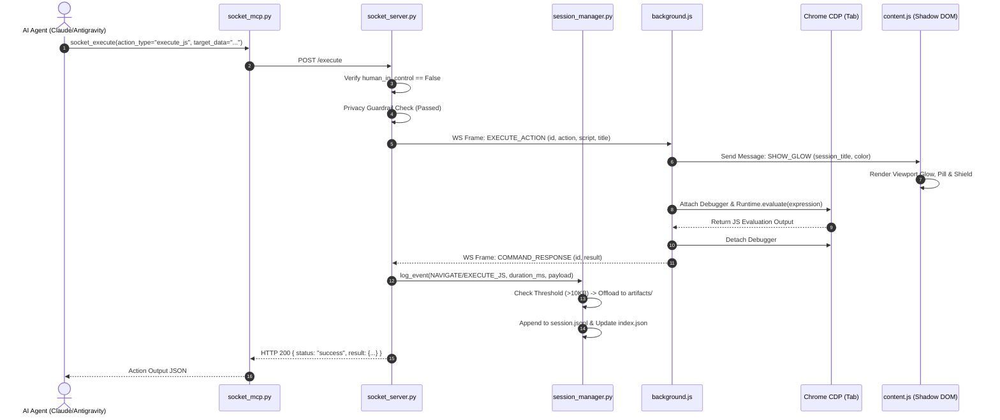
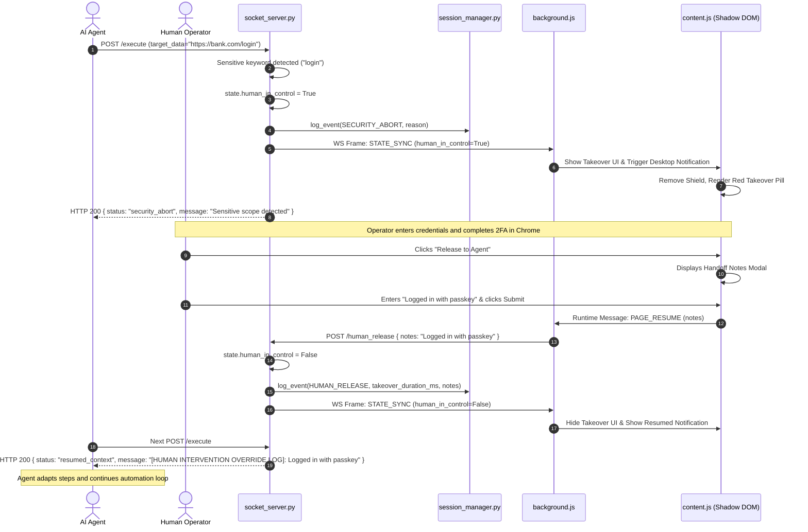
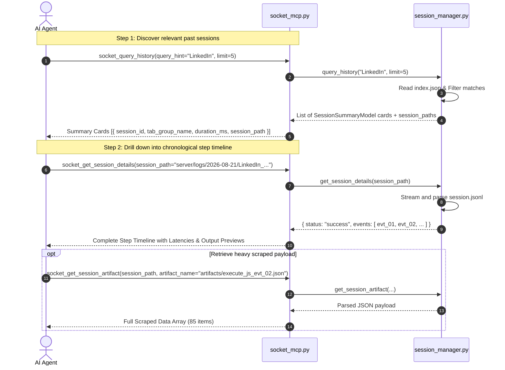

# 🔌 AgentSocket Complete Codebase & Architectural Specification

**Version:** 1.1.0  
**Specification Type:** Master Engineering Documentation & Component Reference  
**Scope:** Complete Python Server, MV3 Chrome Extension, FastMCP Subsystem, CDP Execution Engine, Shadow DOM HUD, and Session Logging System.

---

# 1. Executive Architecture & System Topology

AgentSocket is a zero-latency, plug-and-play browser automation gateway and Model Context Protocol (MCP) server. It connects AI agent frameworks (e.g., Claude Code, Antigravity, custom agents) directly to local Chrome browser sessions via a high-speed FastAPI WebSocket bridge, Chrome DevTools Protocol (CDP), and human-agent takeover workflows.

```
┌─────────────────────────────────────────────────────────────────────────────────────────┐
│                                SYSTEM ARCHITECTURE TOPOLOGY                             │
└─────────────────────────────────────────────────────────────────────────────────────────┘

 ┌──────────────────────────┐             ┌──────────────────────────┐
 │  AI Agent (Claude Code,  │             │   Command-Line Interface │
 │   Antigravity, Custom)   │             │   (socket_launcher.py)   │
 └─────────────┬────────────┘             └────────────┬─────────────┘
               │                                       │
               │ (stdio MCP Protocol)                  │ (REST / Local Python)
               ▼                                       ▼
 ┌───────────────────────────────────────────────────────────────────┐
 │                   server/socket_mcp.py (FastMCP)                  │
 └─────────────────────────────────┬─────────────────────────────────┘
                                   │
                                   ▼
 ┌───────────────────────────────────────────────────────────────────┐
 │                server/socket_server.py (FastAPI Gateway)          │
 │  - Session & Inactivity Watchdogs                                 │
 │  - Sensitive Scope & Privacy Gatekeepers                          │
 │  - Human Intervention State Machine                               │
 └───────────────┬───────────────────────────────────┬───────────────┘
                 │                                   │
                 ▼                                   ▼
 ┌──────────────────────────────┐    ┌──────────────────────────────┐
 │ server/session_manager.py    │    │ (WebSocket Bridge :8000)     │
 │  - YYYY-MM-DD Partitioning   │    │ ws://127.0.0.1:8000/ws/ext   │
 │  - session.jsonl Append      │    └───────────────┬──────────────┘
 │  - Artifact Offloading (>10K)│                    │
 │  - Atomic index.json Indexer │                    ▼
 └──────────────────────────────┘    ┌──────────────────────────────┐
                                     │ Chrome Extension Service     │
                                     │ Worker (background.js)       │
                                     │  - ResilientSocket Client    │
                                     │  - Tab Group Manager         │
                                     │  - CDP Controller (debugger) │
                                     └───────┬──────────────┬───────┘
                                             │              │
                     ┌───────────────────────┘              └───────────────────────┐
                     ▼                                                              ▼
 ┌───────────────────────────────────────┐                      ┌───────────────────────────────────────┐
 │ Active Browser Tab (content.js)       │                      │ Extension UI & Settings               │
 │  - Shadow DOM HUD (#agentsocket-host) │                      │  - popup.html / popup.js (Settings)   │
 │  - KeyboardGuard & Interaction Shield │                      │  - auth.html / auth.js (Auth Gate)    │
 │  - Takeover Overlay & Handoff Modal   │                      │  - protocol.js (Shared Constants)     │
 └───────────────────────────────────────┘                      └───────────────────────────────────────┘
```

---

# 2. Complete Repository File Structure & Inventory

```
agent_bro_hands/
├── .agents/
│   └── skills/
│       └── browser-socket/
│           └── SKILL.md                 # Antigravity/Agentic Skill Definition
├── .github/
│   ├── ISSUE_TEMPLATE/
│   │   ├── bug_report.md                # Structured bug report template
│   │   ├── feature_request.md           # Structured feature request template
│   │   └── subskill_proposal.md         # Subskill playbook proposal template
│   └── PULL_REQUEST_TEMPLATE.md         # PR checklist with invariant verification
├── docs/
│   ├── codebase_master_specification.md # Full architectural and code documentation
│   ├── installation.md                  # Comprehensive multi-OS & Docker installation guide
│   ├── developer_guide.md               # Advanced builder guide, REST API & WebSocket specs
│   └── subskills_playbook_guide.md      # Playbook authoring rules & selector contracts
├── extension/
│   ├── manifest.json                    # Chrome Extension Manifest V3 configuration
│   ├── protocol.js                      # Universal message types, actions, & response envelopes
│   ├── background.js                    # MV3 Service worker: WebSocket hub, tab manager, CDP engine
│   ├── content.js                       # On-page Shadow DOM HUD, keyboard guard, & takeover modal
│   ├── popup.html                       # Extension toolbar popup interface
│   ├── popup.js                         # Popup UI controller, socket settings, port scanner
│   ├── auth.html                        # One-time agent authorization page
│   ├── auth.js                          # Authorization grant/deny handler
│   └── icons/                           # Extension icon assets (16x16, 48x48, 128x128)
├── server/
│   ├── __init__.py
│   ├── models.py                        # Pydantic schemas, event models, & typed Enums
│   ├── session_manager.py               # Hierarchical session logger, JSONL engine, index manager
│   ├── socket_server.py                 # FastAPI gateway, WebSocket endpoint, watchdog loops
│   ├── socket_launcher.py               # Smart launcher, process manager, CLI tool
│   ├── socket_mcp.py                    # Model Context Protocol stdio server
│   ├── browser_socket.py                # Direct CLI execution alias
│   └── logs/                            # Local session logs & artifact storage (gitignored)
│       ├── subskills_index.json         # Central Registry of reusable subskills & playbooks
│       ├── sessions/
│       │   └── history_logs/
│       │       └── index.json           # Centralized monthly master index
│       └── YYYY-MM-DD/
│           └── <Session_Title>_<time>_gid<tabGroupId>/
│               ├── SESSION_DOCUMENT.md  # Comprehensive auto-generated executive session report
│               ├── session.jsonl        # Line-delimited event log with step latencies
│               ├── sub_skill.md         # Reusable playbook contract with selectors & rules
│               ├── input/               # Source datasets & input batch CSVs
│               ├── output/              # Scraped datasets, enriched CSVs, and deliverables
│               ├── adhocs/              # Diagnostic probes, parser scripts, & helper engines
│               └── artifacts/           # Screenshots & offloaded heavy JSON payloads
├── specs/                               # Engineering Feature Specifications (00 to 14)
├── tests/
│   ├── test_models.py                   # Model validation unit tests
│   ├── test_session_manager.py          # SessionManager and logging unit tests
│   ├── test_subskills.py                # Subskills registry & borrowing engine integration tests
│   ├── test_server.py                   # FastAPI gateway integration tests
│   ├── test_launcher.py                 # Launcher and CLI unit tests
│   └── test_protocol.test.js            # JavaScript protocol unit tests
├── .dockerignore                         # Docker build exclusion rules
├── .gitignore                           # Git ignore rules protecting private logs and caches
├── CODE_OF_CONDUCT.md                   # Contributor Covenant v2.1 standard
├── CONTRIBUTING.md                      # Contribution guidelines, git standards, quality gates
├── DEVELOPER.md                         # Developer framework, custom runners, and MCP guide
├── Dockerfile                           # Headless Chromium + Xvfb container image
├── docker-compose.yml                   # Container orchestration definition
├── INSTALL.md                           # Cross-platform installation and MCP setup manual
├── LICENSE                              # Apache 2.0 Open Source License
├── README.md                            # Primary project documentation
├── requirements.txt                     # Core Python package dependencies
├── SECURITY.md                          # Security policy, privacy invariants, vulnerability reporting
└── SKILL.md                             # Root-level skill reference
```


---

# 3. Server Subsystem Deep Dive

## 3.1 `server/models.py` (Data Contracts & Schemas)

This module defines typed Pydantic models and Enums shared across the FastAPI server, the Session Manager, the MCP server, and the CLI launcher.

### Enums

#### 1. `ActionType(str, Enum)`
- `NAVIGATE = "navigate"`: Commands the browser to load a URL in the designated tab group.
- `EXECUTE_JS = "execute_js"`: Evaluates JavaScript inside the active tab of the target tab group via Chrome DevTools Protocol.
- `TASK_COMPLETE = "task_complete"`: Marks the task completed, renames the tab group with a checkmark (`✅`), and closes active session logging.

#### 2. `WSMessageType(str, Enum)`
- `EXECUTE_ACTION = "execute_action"`: Server -> Extension command frame.
- `COMMAND_RESPONSE = "command_response"`: Extension -> Server action execution result.
- `STATE_CHANGE = "state_change"`: Extension -> Server state update (e.g. human clicked Take Over).
- `STATE_SYNC = "state_sync"`: Server -> Extension state synchronization (e.g. Security Abort fired).
- `PING = "ping"`: Keepalive heartbeat frame.

#### 3. `ControlMode(str, Enum)`
- `AGENT = "agent"`: Autonomous agent is actively driving the browser.
- `HUMAN = "human"`: Human operator has taken over control.

#### 4. `ResponseStatus(str, Enum)`
- `SUCCESS = "success"`: Operation finished successfully.
- `ERROR = "error"`: Operation resulted in an error or exception.
- `HUMAN_LOCKED = "human_locked"`: Outbound requests locked because human operator is in control.
- `SECURITY_ABORT = "security_abort"`: Sensitive input/scope detected; execution paused for human takeover.
- `RESUMED_CONTEXT = "resumed_context"`: Human operator finished manual step; returning handoff notes to the agent.

#### 5. `ErrorCode(str, Enum)`
- `TAB_CLOSED = "TAB_CLOSED"`: Target tab was closed during evaluation.
- `EXECUTION_TIMEOUT = "EXECUTION_TIMEOUT"`: Evaluation timed out (>30s).
- `EXTENSION_OFFLINE = "EXTENSION_OFFLINE"`: Chrome extension is not connected to WebSocket.
- `UNKNOWN_ACTION = "UNKNOWN_ACTION"`: Action type not recognized.
- `CDP_ERROR = "CDP_ERROR"`: Chrome DevTools Protocol returned an error or JS exception.
- `AUTH_REQUIRED = "AUTH_REQUIRED"`: User has not yet granted one-time authorization.
- `TASK_ABORTED = "TASK_ABORTED"`: Task cancelled by operator.
- `INTERNAL_ERROR = "INTERNAL_ERROR"`: Server-side internal failure.

#### 6. `SessionStatus(str, Enum)`
- `ACTIVE = "active"`: Session is actively recording events.
- `COMPLETED = "completed"`: Task completed cleanly.
- `STOPPED = "stopped"`: Terminated by user or timed out due to inactivity.
- `ABORTED = "aborted"`: Terminated abruptly (e.g. browser disconnect).
- `ERROR = "error"`: Session encountered a fatal execution failure.

#### 7. `SessionEventType(str, Enum)`
- `SESSION_START = "session_start"`: Initial session creation event.
- `NAVIGATE = "navigate"`: Browser navigation event.
- `EXECUTE_JS = "execute_js"`: JavaScript execution event.
- `CDP_EVAL_RESULT = "cdp_eval_result"`: Raw CDP evaluation return event.
- `SECURITY_ABORT = "security_abort"`: Sensitive keyword guardrail trigger event.
- `HUMAN_TAKEOVER = "human_takeover"`: Operator takeover initiation event.
- `HUMAN_RELEASE = "human_release"`: Operator handoff release event.
- `SUB_SKILL_BORROWED = "subskill_borrowed"`: Playbook and tooling cloned from another session.
- `TASK_COMPLETE = "task_complete"`: Task complete notification event.
- `ERROR = "error"`: Execution error or timeout event.
- `SESSION_END = "session_end"`: Final session closing event.

---

### Pydantic Models

#### `SubskillModel`
Metadata model for registered, reusable tested subskills (`subskills_index.json`).
- `name` (`str`): Unique slug (e.g. `"linkedin-crm-enricher"`).
- `display_title` (`str`): Human-readable title.
- `description` (`str`): Execution playbook and capability overview.
- `tags` (`list[str]`): Discovery tags (e.g. `["linkedin", "crm", "enrichment"]`).
- `latest_session_path` (`str`): Relative path to source session folder.
- `subskill_file` (`str`): Path to playbook contract (`"sub_skill.md"`).
- `adhoc_tools` (`list[str]`): List of helper scripts packaged in `adhocs/`.
- `input_schema_preview` (`Optional[str]`): Description or sample header of input dataset.
- `output_schema_preview` (`Optional[str]`): Description or sample header of output deliverables.
- `times_borrowed` (`int`): Borrowing counter.
- `success_rate` (`float`): Percentage reliability benchmark.
- `created_at` (`float`): Registration timestamp.
- `updated_at` (`float`): Last update timestamp.

#### `SubskillsIndexModel`
Central registry model for `server/logs/subskills_index.json`.
- `updated_at` (`float`): Last registry modification timestamp.
- `subskills` (`dict[str, SubskillModel]`): Map of registered subskills keyed by slug.

#### `BorrowSubskillRequest`
Payload for `/subskills/borrow` endpoint and `socket_borrow_subskill` MCP tool.
- `subskill_name` (`str`): Target subskill name.
- `target_session_title` (`Optional[str]`): Name for the new or active session.
- `input_file_path` (`Optional[str]`): Path to source dataset to copy into `input/`.

#### `RegisterSubskillRequest`
Payload for `/subskills/register` endpoint and `socket_register_subskill` MCP tool.
- `session_path` (`str`): Source session folder path.
- `name` (`str`): Desired subskill slug.
- `display_title` (`Optional[str]`): Display title.
- `description` (`Optional[str]`): Subskill summary.
- `tags` (`Optional[list[str]]`): Tag list.

#### `AgentActionPayload`
Input schema for `/execute` endpoint and `socket_execute` MCP tool.
- `id` (`str`): Unique correlation UUID.
- `action_type` (`ActionType`): Action to execute.
- `target_data` (`str`): URL or JavaScript code.
- `requires_privacy_check` (`bool`, default `False`): Flag forcing human takeover.
- `session_title` (`Optional[str]`, default `None`): Name for the tab group session.
- `group_color` (`Optional[str]`, default `None`): Color accent for the tab group.

#### `ReleasePayload`
Input schema for `/human_release` endpoint.
- `notes` (`Optional[str]`): Operator handoff explanation.

#### `ErrorDetail`
- `code` (`str`): ErrorCode string.
- `message` (`str`): Descriptive error message.

#### `StandardResponse`
- `status` (`ResponseStatus`): Response status.
- `data` (`Optional[Any]`): Result payload.
- `error` (`Optional[ErrorDetail]`): Error details if failed.
- `message` (`Optional[str]`): Additional message.
- `timestamp` (`float`): Unix timestamp.

#### `ServerStatusResponse`
- `status` (`str`): Server status string.
- `extension_connected` (`bool`): WebSocket connection status.
- `human_in_control` (`bool`): Operator lock status.
- `last_intervention_notes` (`Optional[str]`): Handoff notes.
- `idle_seconds_remaining` (`float`): Remaining time before gateway auto-shutdown.

#### `SessionEventModel`
Represents an individual event line inside `session.jsonl`.
- `event_id` (`str`): Auto-generated unique ID (`evt_<8hex>`).
- `session_id` (`str`): Parent session identifier.
- `start_time` (`float`): Step dispatch start timestamp.
- `end_time` (`Optional[float]`): Step completion timestamp.
- `duration_ms` (`Optional[float]`): Execution duration in milliseconds.
- `type` (`SessionEventType`): Event category.
- `title` (`str`): Human-readable event description.
- `tab_id` (`Optional[int]`): Chrome tab ID.
- `tab_group_id` (`Optional[int]`): Chrome tab group ID.
- `url` (`Optional[str]`): Associated URL.
- `payload` (`Optional[dict[str, Any]]`): Event payload or offload preview.
- `artifact_link` (`Optional[str]`): Relative path to offloaded payload or screenshot.

#### `SessionSummaryModel`
Aggregated session metadata recorded in master `index.json`.
- `session_id` (`str`): `sess_YYYYMMDD_HHMMSS_<tabGroupId>`.
- `session_title` (`str`): `<Name> | YYYY-MM-DD_HH:MM:SS`.
- `tab_group_id` (`int`): Native Chrome tab group ID.
- `tab_group_name` (`str`): Sanitized tab group name.
- `agent_name` (`str`, default `"AgentSocket Local"`): Calling agent ID.
- `group_color` (`str`, default `"purple"`): Accent color.
- `status` (`SessionStatus`): Final session status.
- `start_time` (`float`): Session start time.
- `end_time` (`Optional[float]`): Session end time.
- `duration_ms` (`Optional[float]`): Total session duration.
- `event_count` (`int`): Total logged events.
- `action_count` (`int`): Total executed actions.
- `takeover_count` (`int`): Number of human takeovers.
- `session_path` (`str`): Relative directory path.
- `artifacts_count` (`int`): Number of stored artifacts.
- `end_reason` (`Optional[str]`): Reason for session conclusion.

#### `MonthlyIndexModel`
Master index structure.
- `updated_at` (`float`): Index modification timestamp.
- `months` (`dict[str, list[SessionSummaryModel]]`): Monthly session records keyed by `"YYYY-MM"`.

---

## 3.2 `server/session_manager.py` (Session Logging & Subskills Engine)

The `SessionManager` class manages directory partitioning, atomic file writes, threshold offloading, monthly indexing, subskill packaging, borrowing, and consolidated report generation.

### Core Architecture & In-Memory State

- `ActiveSession` (`dataclass`): Tracks runtime state for an active tab group session (start time, last action time, event counters, directory paths, human takeover start time, structured subfolder paths).
- `self.active_sessions: dict[int, ActiveSession]`: Map of active sessions keyed by Chrome `tab_group_id`.
- `self.title_to_group_id: dict[str, int]`: Early title-to-group map before tab ID assignment.

### Methods Reference

#### `get_or_create_session(tab_group_id, tab_group_name, group_color, agent_name) -> ActiveSession`
1. Checks if session already exists for `tab_group_id`.
2. If new:
   - Formats date string (`YYYY-MM-DD`) and timestamp (`HH-MM-SS`).
   - Sanitizes title for filesystem compatibility (`sanitize_filename`).
   - Allocates isolated session folder: `server/logs/YYYY-MM-DD/<Title>_<HH-MM-SS>_gid<id>/`.
   - Automatically creates structured subdirectories: `input/`, `output/`, `adhocs/`, `artifacts/`.
   - Writes initial `SESSION_START` event to `session.jsonl`.
   - Updates `index.json` atomically.

#### `get_session_paths(session_or_group_id) -> dict[str, str]`
Returns an inventory of paths for any session folder:
- `session_dir`: Absolute root path of the session folder.
- `input_dir`: Path to `input/` folder.
- `output_dir`: Path to `output/` folder.
- `adhocs_dir`: Path to `adhocs/` folder.
- `artifacts_dir`: Path to `artifacts/` folder.
- `subskill_path`: Path to `sub_skill.md`.
- `session_doc_path`: Path to `SESSION_DOCUMENT.md`.
- `jsonl_path`: Path to `session.jsonl`.

#### `register_subskill(session_path, name, display_title, description, tags) -> SubskillModel`
Packages a completed session directory as a reusable subskill:
1. Validates that `session_path` exists.
2. If `sub_skill.md` does not exist, scaffolds a template contract with selector rules.
3. Scans `adhocs/` for utility scripts.
4. Updates `server/logs/subskills_index.json` atomically with `SubskillModel`.

#### `list_subskills(query=None, tags=None) -> list[SubskillModel]`
Scans `subskills_index.json` with fuzzy title/name search and tag filtering.

#### `get_subskill(name) -> dict`
Retrieves subskill metadata, full playbook contents (`sub_skill.md`), and parsed adhoc tool docstrings.

#### `borrow_subskill(subskill_name, target_session_title=None, input_file_path=None) -> dict`
Clones a subskill's capabilities into an active or new session:
1. Resolves source subskill from `subskills_index.json`.
2. Initializes target session folder.
3. Copies `sub_skill.md` and all helper tools from `adhocs/` into the target workspace.
4. If `input_file_path` provided, copies dataset into `target/input/`.
5. Emits `subskill_borrowed` event into target `session.jsonl`.
6. Increments `times_borrowed` in central registry.
7. Automatically compiles and generates `SESSION_DOCUMENT.md`.

#### `generate_session_document(session_or_group_id) -> str`
Compiles an exhaustive, self-contained Markdown report (`SESSION_DOCUMENT.md`) containing:
1. Executive Metadata (Session ID, duration, status, tab group accent, agent).
2. Playbook Contract (`sub_skill.md`).
3. Input Inventory (`input/` datasets).
4. Output Deliverables (`output/` files and records).
5. Adhoc Tools (`adhocs/` scripts and docstrings).
6. Artifacts Inventory (`artifacts/` screenshots and JSON dumps).
7. Chronological Execution Thread (ASCII timeline).

#### `log_event(tab_group_id, event_type, title, start_time, end_time, tab_id, tab_group_id_val, url, payload, screenshot_bytes) -> SessionEventModel`
1. Computes millisecond latency: `duration_ms = (end_time - start_time) * 1000`.
2. **Screenshot Handling**: If `screenshot_bytes` provided, writes `artifacts/error_screenshot_<event_id>.png` and sets `artifact_link`.
3. **Threshold Offload Evaluation**:
   - If payload string > 10,000 characters (10 KB) OR list contains > 50 items:
     - Offloads full JSON payload to `artifacts/<action_type>_<event_id>.json`.
     - Injects compact preview (`<500` characters or `"[Array of N items offloaded]"`), sets `is_offloaded: True`, and links `artifact_link`.
4. Appends JSON line to `session.jsonl` with immediate `flush()` and `os.fsync()`.
5. Updates session counters (`event_count`, `action_count`, `takeover_count`, `artifacts_count`) and calls `_update_index_for_session()`.

#### `finalize_session(tab_group_id_or_session_id, status, end_reason) -> ActiveSession`
1. Sets `end_time = time.time()`.
2. Computes total session duration `duration_ms`.
3. Logs `SESSION_END` event to `session.jsonl`.
4. Compiles final `SESSION_DOCUMENT.md`.
5. Updates `index.json` and removes session from `active_sessions`.

#### `check_inactivity(inactivity_threshold_seconds=300.0) -> list[int]`
Watchdog method executed every 10–30s. Automatically finalizes any active session where `time.time() - last_action_time > 300s` with `status="stopped"` and `end_reason="inactivity_timeout"`.

#### `handle_disconnect() -> list[int]`
Invoked when WebSocket connection closes. Immediately finalizes all active sessions with `status="aborted"` and `end_reason="browser_disconnected"`.

#### `query_history(query_hint="", month=None, limit=10) -> list[dict]`
Scans `index.json` for matches against query string or month. Returns summaries sorted newest first.

#### `format_session_thread(details_or_events, session_title=None, total_duration_ms=None) -> str`
Formats chronological events into a tree-structured ASCII timeline thread with exact step timestamps, relative offsets `(T+SS.Ss)`, event icons, step durations, and contextual details.

#### `get_session_details(session_path) -> dict`
Streams and parses `session.jsonl` from target directory, returning the complete chronological step timeline (`events`) along with the pre-rendered tree visualization (`formatted_thread`).

#### `get_session_artifact(session_path, artifact_name) -> dict | str`
Resolves target artifact from `artifacts/` subfolder. Parses JSON files or returns file path for binary assets (e.g. screenshots).

#### `export_all_to_markdown(month=None, output_path=None) -> str`
Generates a comprehensive Markdown report with overview metrics, session summary tables, ASCII thread timeline blocks, step-by-step event drilldowns, latencies, operator notes, and artifact links.

---

## 3.3 `server/socket_server.py` (FastAPI Gateway)

Provides the REST API and WebSocket bridge connecting AI agents to Chrome.

### State & Lifecycle Management

- `SystemState`: Tracks active WebSocket (`extension_ws`), human takeover state (`human_in_control`), takeover start time (`takeover_start_time`), last handoff notes (`last_intervention_notes`), and pending async futures (`pending_responses: dict[str, asyncio.Future]`).
- `idle_watchdog_loop()`: Asynchronous background loop checking:
  1. Tab group session inactivity via `session_manager.check_inactivity(300.0)`.
  2. Gateway idle timeout (`SOCKET_IDLE_TIMEOUT`, default 1200s / 20 mins) with clean process exit.
- `lifespan(app)`: Handles startup PID file generation (`.socket_server.pid`), watchdog spawning, and clean shutdown abort handlers.

### HTTP Endpoints

| Method | Endpoint | Description |
|:---|:---|:---|
| `GET` | `/` | Basic gateway health & idle seconds remaining |
| `GET` | `/status` | Gateway status, extension connection state, human lockout state, handoff notes |
| `GET` | `/history` | Query past sessions (`query`, `month`, `limit`) |
| `GET` | `/session/details` | Retrieve parsed `session.jsonl` chronological thread (`path`) |
| `GET` | `/session/document` | Retrieve or generate `SESSION_DOCUMENT.md` (`path` or `group_id`) |
| `GET` | `/session/artifact` | Retrieve offloaded JSON or screenshot artifact (`path`, `name`) |
| `GET` | `/subskills` | List registered subskills from central registry (`query`, `tags`) |
| `GET` | `/subskills/{name}` | Get subskill metadata, playbook contract, and adhoc tools |
| `POST` | `/subskills/borrow` | Clone subskill playbook and scripts into session workspace |
| `POST` | `/subskills/register` | Register completed session as a named reusable subskill |
| `POST` | `/execute` | Dispatches browser action to Chrome extension |
| `POST` | `/human_release` | Releases human operator lockout and passes handoff notes |
| `POST` | `/stop` | Cancels active browser tasks and resets state |
| `WS` | `/ws/extension` | High-speed bidirectional WebSocket bridge with extension |

---

## 3.4 `server/socket_mcp.py` (Model Context Protocol Server)

Exposes standard Model Context Protocol (MCP) tools over `stdio` for agent frameworks (Claude Code, Antigravity, Cursor, etc.).

### Exposed MCP Tools

1. **`socket_execute(action_type, target_data, requires_privacy_check, session_title)`**
   - Boots gateway/browser if needed, then executes action (`navigate`, `execute_js`, `task_complete`).
2. **`socket_status()`**
   - Returns current connection state, human lockout status, and handoff notes.
3. **`socket_release_takeover(notes)`**
   - Releases human intervention lockout and injects operator notes back to the agent.
4. **`socket_stop()`**
   - Immediately aborts active browser automation tasks.
5. **`socket_query_history(query_hint, month, limit)`**
   - Step 1 of lazy retrieval: Scans `index.json` and returns lightweight session summary cards.
6. **`socket_get_session_details(session_path)`**
   - Step 2 of lazy retrieval: Parses `session.jsonl` and returns the complete chronological step timeline.
7. **`socket_get_session_artifact(session_path, artifact_name)`**
   - Reads offloaded heavy data payloads or screenshot paths.
8. **`socket_get_session_document(session_path)`**
   - Retrieves or auto-generates the comprehensive consolidated Markdown report (`SESSION_DOCUMENT.md`).
9. **`socket_list_subskills(query, tags)`**
   - Lists registered reusable subskills from `subskills_index.json`.
10. **`socket_get_subskill(name)`**
    - Retrieves subskill playbook (`sub_skill.md`) and adhoc tools list.
11. **`socket_borrow_subskill(subskill_name, target_session_title, input_file_path)`**
    - Clones subskill playbook and scripts to target workspace and registers borrowing event.
12. **`socket_register_subskill(session_path, name, display_title, description, tags)`**
    - Registers completed session folder as a named subskill in the central registry.

---

## 3.5 `server/socket_launcher.py` (Smart Launcher & CLI)

Handles process lifecycle, Chrome auto-detection, auto-launching, and CLI history/subskills management.

### Key Utilities

- `find_chrome_path()`: Cross-platform detection of Chrome / Chromium (Windows Registry + ProgramFiles, macOS Applications, Linux `/usr/bin`).
- `is_pid_running(pid)`: Checks if a process ID is actively executing (`tasklist` on Windows, `os.kill(pid, 0)` on Unix).
- `ensure_server_running(port, timeout)`: Auto-boots FastAPI gateway in background if inactive.
- `launch_chrome_with_extension(extension_dir)`: Auto-launches Chrome with `--load-extension` and `--remote-debugging-port=9222`.
- `ensure_ready()`: Guarantees gateway server and browser extension are fully booted and connected.

### CLI Subcommands

```bash
# Core execution & control
python server/socket_launcher.py status                  # Gateway & extension socket status
python server/socket_launcher.py plug                    # Boot gateway & browser on-demand
python server/socket_launcher.py navigate <url>          # Navigate browser tab to URL
python server/socket_launcher.py eval <code>             # Run JavaScript in active tab
python server/socket_launcher.py release --notes "..."   # Release human lockout
python server/socket_launcher.py stop                    # Stop running tasks
python server/socket_launcher.py kill                    # Terminate gateway process

# History & Session Reports
python server/socket_launcher.py history [--month]       # Print ASCII table of past sessions
python server/socket_launcher.py logs --path <path>      # Print chronological event thread
python server/socket_launcher.py doc --path <path>       # Print/generate SESSION_DOCUMENT.md
python server/socket_launcher.py export-all [--out]      # Export master timeline to Markdown

# 📦 Subskills & Borrowing Engine
python server/socket_launcher.py subskills list
python server/socket_launcher.py subskills show <name>
python server/socket_launcher.py subskills borrow <name> --title "<title>" --input <path>
python server/socket_launcher.py subskills register --session <path> --name <name> --tags "<tags>"
```

# 4. Chrome Extension Subsystem Deep Dive

## 4.1 `extension/manifest.json` (Extension Configuration)

- **Manifest Version:** MV3 (Service Worker based).
- **Permissions:**
  - `activeTab`, `tabs`: Tab querying, updating, and navigation.
  - `tabGroups`: Creating, coloring, querying, and updating tab groups.
  - `scripting`: Dynamic script execution fallback.
  - `debugger`: Direct Chrome DevTools Protocol (CDP) attachment for zero-CSP JS evaluation.
  - `storage`: Local persistence of server configs and authorization flags.
  - `notifications`: Native OS desktop alerts on Security Abort and Takeover.
  - `alarms`: 24-second service worker keepalive timer.
- **Host Permissions:** `<all_urls>` (universal automation capability).
- **Background Worker:** `background.js`.
- **Content Scripts:** `protocol.js` and `content.js` injected across `<all_urls>`.

---

## 4.2 `extension/protocol.js` (Universal Message Protocol)

An isomorphic UMD module (compatible with Browser Window, MV3 Service Worker, Content Scripts, and Node.js test runners).

- `MessageTypes`: Frozen enum of message identifiers.
- `ActionTypes`: `NAVIGATE`, `EXECUTE_JS`, `TASK_COMPLETE`.
- `ControlModes`: `AGENT`, `HUMAN`.
- `ResponseStatus`: `SUCCESS`, `ERROR`, `HUMAN_LOCKED`, `SECURITY_ABORT`, `RESUMED_CONTEXT`.
- `ErrorCodes`: Standardized error codes (`TAB_CLOSED`, `EXECUTION_TIMEOUT`, `CDP_ERROR`, etc.).
- `createResponseEnvelope(status, data, error)`: Factory for uniform response payloads.
- `createErrorEnvelope(code, message)`: Factory for uniform error payloads.

---

## 4.3 `extension/background.js` (Hub & CDP Controller)

The background service worker coordinates WebSocket communication, tab group isolation, CDP command dispatch, proactive session synchronization, and human takeover flows.

### 1. `ResilientSocket` Class
Manages persistent, auto-reconnecting WebSocket connections to agent servers:
- `connect()`: Initializes `WebSocket(url)`, registers `onopen`, `onmessage`, `onclose`, `onerror`.
- `scheduleReconnect()`: Implements randomized exponential backoff (up to 30s) when disconnected.
- `send(payload)`: Dispatches JSON frames if socket state is `OPEN`.
- `ping()`: Sends keepalive ping frame.
- `close()`: Cleanly disposes socket and cancels reconnect timers.

### 2. Proactive Session Discovery & Script Injection Fallback
- `sendGlowToTab(tabId, sessionTitle, groupColor)`:
  - Dispatches `SHOW_GLOW` message to `content.js`.
  - If content script was not yet loaded or was unloaded during SPA navigation, automatically invokes `chrome.scripting.executeScript({ target: { tabId }, files: ["protocol.js", "content.js"] })` and re-dispatches `SHOW_GLOW`.
- `CHECK_TAB_SESSION` Handler:
  - Answers startup queries from `content.js`.
  - Inspects `sender.tab.groupId` against active tab groups.
  - Immediately returns `{ inActiveSession: true, session_title, group_color, human_in_control }` so the on-page HUD and shield mount instantly upon page load or client-side navigation.
- `chrome.tabs.onUpdated` Listener:
  - Monitors both `loading` and `complete` tab lifecycle states to ensure persistent visual indicators throughout page navigation.

### 3. Tab Group Isolation & Lifecycle
- `handleNavigation(url, sessionTitle, groupColor)`:
  - Queries existing tab group by `title: sessionTitle`.
  - If found: Reuses existing tab or creates new tab inside the existing group, then calls `sendGlowToTab(...)`.
  - If not found: Creates fresh tab, calls `chrome.tabs.group()`, assigns title + color (`chrome.tabGroups.update()`), and illuminates the tab.
- `createAndGroupTab()`, `createFreshSocketGroup()`: Low-level Chrome API wrappers ensuring atomic tab grouping.
- `handleTaskComplete(sessionTitle)`: Queries tab group, prepends `✅` to title, sets color to `grey`, and clears page glows.

### 4. CDP Execution Engine (`handleExecuteJS`)
- `attachDebugger({ tabId })`: Attaches to Chrome CDP version `"1.3"`. Handles `"Already attached"` gracefully.
- `sendCDPCommand(target, "Runtime.evaluate", { expression, returnByValue: true, awaitPromise: true })`:
  - Executes arbitrary JavaScript in the isolated page context, bypassing page CSP restrictions.
  - Resolves promises asynchronously (`awaitPromise: true`).
- `activeEvaluations` Map: Tracks pending evaluations per tab. If a user closes the tab mid-execution (`chrome.tabs.onRemoved`), immediately rejects the promise with `"Tab was closed during execution."`.
- 25-second evaluation timeout promise race.
- Exception Details extraction: Unwraps `res.exceptionDetails.exception.description` or text for clear diagnostic reporting.
- `finally` block: Guarantees `detachDebugger({ tabId })` is called to prevent lingering debugger banners.

### 5. Port Auto-Discovery (`scanLocalPorts`)
Scans standard agent gateway ports (`8000`, `8080`, `8500`, `9000`, `9500`). For each responsive endpoint, automatically adds the server config to `chrome.storage.local` and establishes a `ResilientSocket`.

---

## 4.4 `extension/content.js` (Shadow DOM On-Page HUD & Shield)

Injected into all web pages to provide a non-intrusive, Notion-styled on-page HUD, keyboard interaction shield, and human takeover overlay.

### 1. Shadow DOM Encapsulation (`#agentsocket-hud-host`)
- Mounts custom element `<agentsocket-hud-host>` directly to `document.documentElement`.
- Uses `host.attachShadow({ mode: "open" })` with isolated internal styles.
- `clearShadowRootViews(shadowRoot)`: Cleans active views while preserving encapsulated `<style>` declarations.
- **Zero Style Bleed**: Host page CSS rules cannot affect the HUD, and HUD styles cannot alter host page elements.

### 2. Proactive Startup Discovery (`checkInitialSessionState`)
- Executed on `DOMContentLoaded` or immediate script execution.
- Sends `CHECK_TAB_SESSION` to the background service worker.
- If the current tab belongs to an active automation session, immediately invokes `renderActiveGlow()` and activates the interaction shield without waiting for a new action message.

### 3. Interaction Shield & `keyboardGuard`
- While agent is running (`isShieldActive = true`):
  - Captures `keydown`, `keyup`, and `keypress` events during the capture phase (`useCapture = true`).
  - Checks `e.composedPath()`: Allows keystrokes inside the Shadow DOM HUD inputs while blocking accidental keystrokes on the host page.
  - Intercepts clicks on the viewport and displays a brief tooltip (`showInterventionTooltip`): *"Agent is operating. Click 'Take Over' below to interact."*

### 4. Visual States & Modals
- **State A: Active Glow & Pill (`renderActiveGlow`)**:
  - Full-viewport outline styled according to tab group color accent (`#9A6DD7` purple, `#529CCA` blue, `#4DAB9A` green, etc.).
  - Floating bottom pill with status dot, session title, "Take Over" button (`#eb5757`), and "Stop" button.
- **State B: Operator Takeover (`renderTakeoverUI`)**:
  - Dashed red border outline.
  - Shield removed—full user interaction restored to host page.
  - Bottom pill shows "Operator Active", "Stop", and "Release to Agent" (`#0f7b6c`).
- **State C: Handoff Notes Modal (`renderNotesModal`)**:
  - Centered dark modal dialog with handoff notes textarea.
  - On submit: Dispatches `PAGE_RESUME` message with operator notes to background service worker.


---

## 4.5 `extension/popup.html` & `extension/popup.js` (Control Center)

- **Mode Switcher**: Displays current state ("Auto Engine" / "Manual Active") and allows manual takeover toggle with optional intervention notes.
- **Agent Sockets Manager**: Lists configured agent servers with live status dots (🟢 Online, 🔴 Offline, ⚫ Disabled).
- **Dynamic Configuration**: Add, edit, remove agent servers; customize color accents; toggle enable switches.
- **Auto-Scan Button**: Triggers `scan_local_agents` to auto-discover running local agent gateways.
- **Status Poller**: 1.5-second polling loop checking connection health across all enabled sockets.

---

## 4.6 `extension/auth.html` & `extension/auth.js` (One-Time Security Gate)

- Displayed automatically when an unauthenticated agent attempts to establish a session.
- Prompts the user to **Grant** or **Deny** local browser automation privileges.
- Sets `agent_authorized: true` in `chrome.storage.local` and notifies `background.js` to resume pending commands.

---

# 5. Data Flows & Execution Sequences

## 5.1 Standard Autonomous Action Execution



---

## 5.2 Security Abort & Operator Takeover Flow



---

## 5.3 Two-Step Lazy MCP Introspection Flow



---

# 6. Test Suite & Verification Matrix

The test suite validates models, server endpoints, state machines, the session manager, and CLI utilities.

```bash
# Run all tests
python -m unittest discover tests
```

### Test Coverage Summary

| Test File | Target Module | Key Test Cases |
|:---|:---|:---|
| [`tests/test_models.py`](file:///c:/Users/20106/agent_bro_hands/tests/test_models.py) | `server/models.py` | Enums, payload validation, session event models, summary models, monthly index serialization, subskills models. |
| [`tests/test_session_manager.py`](file:///c:/Users/20106/agent_bro_hands/tests/test_session_manager.py) | `server/session_manager.py` | Date partitioning, latency benchmarks, 10KB string / 50-item list offloading, error screenshots, zero-credential takeover logging, 5min inactivity timeout, disconnect aborts, index updates, markdown export. |
| [`tests/test_subskills.py`](file:///c:/Users/20106/agent_bro_hands/tests/test_subskills.py) | `server/session_manager.py` | Session directory structure (`input/`, `output/`, `adhocs/`, `artifacts/`), subskill registration, central registry index, borrowing workflow, and single `SESSION_DOCUMENT.md` compilation. |
| [`tests/test_server.py`](file:///c:/Users/20106/agent_bro_hands/tests/test_server.py) | `server/socket_server.py` | Root/status endpoints, privacy flag trigger, keyword trigger, human locked state, release handoff context injection, stop endpoint, offline extension error, `/history` and `/subskills` REST endpoints. |
| [`tests/test_launcher.py`](file:///c:/Users/20106/agent_bro_hands/tests/test_launcher.py) | `server/socket_launcher.py` | Chrome detection, PID lifecycle, stale PID cleanup, offline fallback query helpers, table/log formatters, and subskills CLI parsing. |
| [`tests/test_protocol.test.js`](file:///c:/Users/20106/agent_bro_hands/tests/test_protocol.test.js) | `extension/protocol.js` | JavaScript UMD module loading, message types, action types, response envelopes, error envelopes. |

---

# 7. Summary & Architectural Invariants

1. **Strict Zero-Credential Storage**: AgentSocket never captures, writes, or persists user passwords, OTPs, or credit card numbers to disk.
2. **Headless Extension Model**: The Chrome extension has zero local storage bloat; all persistent history and heavy artifacts reside on the local server (`server/logs/`).
3. **Shadow DOM Isolation**: On-page HUD elements are completely encapsulated inside `#agentsocket-hud-host`, guaranteeing zero CSS interference with target websites.
4. **Resilient Communication**: WebSocket connections feature randomized exponential backoff and 24-second keepalive alarms.
5. **Two-Step Lazy Introspection**: AI agents inspect past execution history in two efficient steps without token waste or memory overload.
6. **Session-Isolated Subskills**: Every session is fully self-contained with its own `input/`, `output/`, `adhocs/`, `artifacts/`, `sub_skill.md`, and `SESSION_DOCUMENT.md`, allowing proven browser capabilities to be borrowed across tasks with full provenance.

---

# 8. Feature Specification 14: Open Source Readiness Suite & Developer Ecosystem

Feature Spec 14 establishes the open-source governance framework, multi-agent onboarding documentation, community issue templates, containerization architecture, and developer extension guides:

### 8.1 Open Source Deliverables Breakdown
* **Root Onboarding Suite**: `INSTALL.md`, `DEVELOPER.md`, `CONTRIBUTING.md`, `SECURITY.md`, `LICENSE` (Apache 2.0), `CODE_OF_CONDUCT.md` (Contributor Covenant 2.1), `requirements.txt`.
* **GitHub Community Governance (`.github/`)**:
  - `ISSUE_TEMPLATE/bug_report.md`: Standardized bug submission with environment telemetry and error capture.
  - `ISSUE_TEMPLATE/feature_request.md`: Structured feature proposals with security impact assessment.
  - `ISSUE_TEMPLATE/subskill_proposal.md`: Community playbook contribution template with selector hierarchy.
  - `PULL_REQUEST_TEMPLATE.md`: Comprehensive review checklist enforcing all 5 architectural invariants.
* **Deep Builder & Deployment Guides (`docs/`)**:
  - `docs/installation.md`: Multi-OS setup, alternative Chromium browsers (Brave, Edge), enterprise firewalls, and MCP setup matrix.
  - `docs/developer_guide.md`: Complete HTTP REST API reference, WebSocket protocol frame formats, and CDP execution mechanics.
  - `docs/subskills_playbook_guide.md`: Step-by-step authoring guide for high-accuracy browser skills and CLI registry workflows.
* **Docker Headless Containerization**: `Dockerfile`, `docker-compose.yml`, `.dockerignore` enabling cloud deployments using Xvfb virtual displays.


